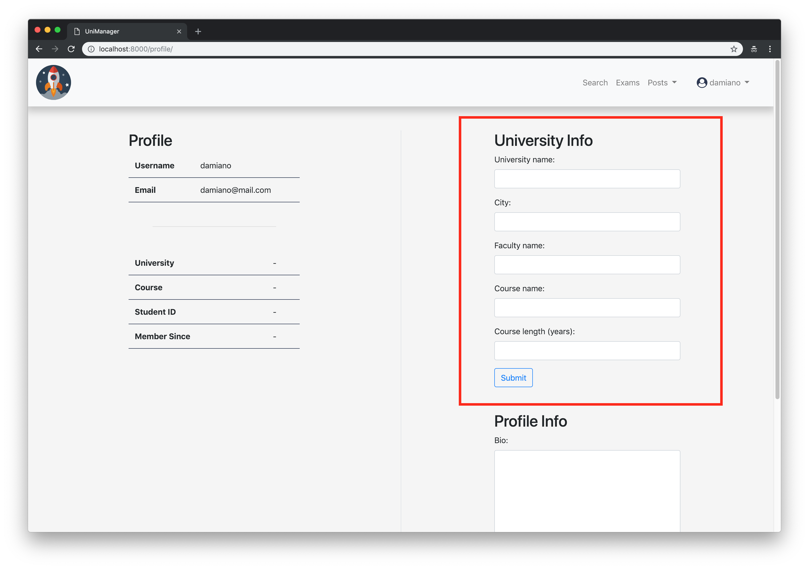

# UniManager

A simple interface to keep you up to date with your exams and to get in touch with other students.

## Requirements
- Python 3.x installed
- Pip 3 installed

## Installation
1. Download the zip file
1. Unzip it

### Run installation script
Move into UniManager-master
```
$ cd UniManager-master
```
Install 
```
$ bash install.sh
```

During the setup you will be asked for the admin password, this credentials are needed for the /admin endpoint
<br>
The admin credentials:
```
username: admin
password: the one you chose during the installation
```

# Signup
Open your browser of choice and navigate to [Unimanager](http://localhost:8000/accounts/signup)
<br>
Then signup using the form on the right


# Add Your Infos
Navigate to [your profile](http://localhost:8000/profile) or click in the upper right corner the dropdown menu and choose "Settings"
<br>
Add your university infos using the first form on the right of the page.


# You're Done!
Now you can search for other users, categories, posts and you can register your exams!
